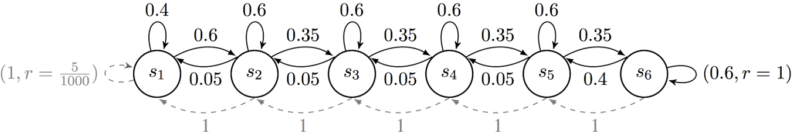
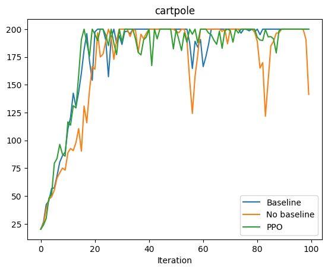

# CS234_Reinforcement_Learning (Spring 2024)

This repo contains Stanford CS234 **2024 spring** assignment's coding problems (as claimed by the original repo owner), and some personally taken notes after watching the [free video lectures on Youtube](https://www.youtube.com/playlist?list=PLoROMvodv4rN4wG6Nk6sNpTEbuOSosZdX). The official course website is [here](https://web.stanford.edu/class/cs234/), which contains entire course materials for the **latest** offering, for example, winter 2025. So please be advised that the assignments here might not match the latest course material exactly.

Feel free to follow the instructions in each problem directory to run and test it.

### Attribution

Based on https://github.com/Rhyme0730/CS234-Reinforcement-Learning . Commits on and before Feb 4, 2025 were all made by the owner of that repo. Please consider forking that repo if you don't need to make your own independent commits.

### Disclaimer

The *assignment_sub* folder in this repo contains personal attempts at solving the assignment problems (written as [Quarto](https://quarto.org/) docs), not guarateed to be correct at all.

## Assignments

## A1_P4: RiverSwim MDP

## A2_P2: Policy Gradient Methods

## A3_P1-P3: Reward engineering, Learning from preferences(RLHF), Direct preference optimization(DPO)

### PPO (without early termination)

### PPO(with early termination)

### RLHF

