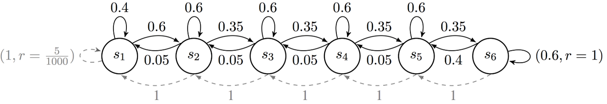
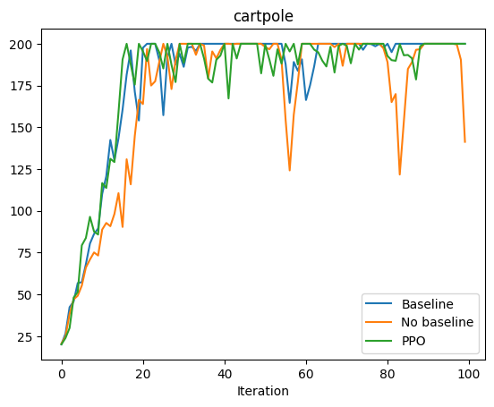

# CS234_Reinforcement_Learning (Spring 2024)

This repo contains Stanford CS234 **2024 spring** assignment's coding problems (*unfilled* templates), and some personal notes after watching the free video lectures on Youtube (also for 2024 spring).

If further interested, [this link](https://web.stanford.edu/class/cs234/modules.html) contains entire public-access course materials for the **latest** offering, for example, winter 2025. Due to being different offerings, please be advised that the assignments in this repo may not match the latest course content exactly.

<!-- TOC -->

- [CS234ReinforcementLearning (Spring 2024)](#cs234reinforcementlearning-spring-2024)
        - [Attribution](#attribution)
        - [Disclaimer](#disclaimer)
    - [Official material links](#official-material-links)
    - [Known issues](#known-issues)
    - [Assignment previews](#assignment-previews)
        - [A1P4: RiverSwim MDP](#a1p4-riverswim-mdp)
        - [A2P2: Policy Gradient Methods](#a2p2-policy-gradient-methods)
        - [A3P1-P3: Reward engineering, Learning from preferences(RLHF), Direct preference optimization(DPO)](#a3p1-p3-reward-engineering-learning-from-preferencesrlhf-direct-preference-optimizationdpo)
            - [PPO (without early termination)](#ppo-without-early-termination)
            - [PPO(with early termination)](#ppowith-early-termination)
            - [RLHF](#rlhf)
    - [Personal notes](#personal-notes)
        - [Lecture notes](#lecture-notes)
        - [Assignment Notes](#assignment-notes)

<!-- /TOC -->

### Attribution

Based on https://github.com/Rhyme0730/CS234-Reinforcement-Learning . Commits on and before Feb 4, 2025 were all made by the owner of that repo. Also there are *finished* assignment code in that repo. Please consider forking that repo if you don't need to make your own independent commits.

### Disclaimer

The *assignment_sub* folder in this repo contains personal attempts at solving the assignment problems (written as [Quarto](https://quarto.org/) docs), not guarateed to be correct at all.

## Official material links

Also for spring 2024 offering.

⚠️ These may expire without notice.

[Lecture videos](https://www.youtube.com/playlist?list=PLoROMvodv4rN4wG6Nk6sNpTEbuOSosZdX) |
[Lecture materials](https://web.stanford.edu/class/cs234/CS234Spr2024/modules.html) |
[Assignment files](https://web.stanford.edu/class/cs234/CS234Spr2024/assignments).

## Known issues

- For A2, the `gym==0.21` in the original requirements.txt may fail the installing because that version is not compatible with some newer setuptools ([../gym/issues/3176](https://github.com/openai/gym/issues/3176)). And even though there is setuptools==65.5.0 in the txt, pip creates an isolated temporary environment to build gym where the setuptools is of another version. For me (setuptools 75.7.0, doing A2 in May 2025), changing it to `gym>=0.21,<0.27` worked.

## Assignment previews

These are preview of results produced by the original repo owner's work on these assignments. Said owner seems to be a PhD at a top institution so these are probably very good references.

### A1_P4: RiverSwim MDP

### A2_P2: Policy Gradient Methods

### A3_P1-P3: Reward engineering, Learning from preferences(RLHF), Direct preference optimization(DPO)

#### PPO (without early termination)

#### PPO(with early termination)

#### RLHF

## Personal notes

Made mostly because I did not take the pre-requisite Machine Learning course at the first time of going through this course.

### Lecture notes

[./notes/NOTES_LECTURES.md](./notes/NOTES_LECTURES.md)

Includes:

- Some hand-written process for worked examples mentioned in lectures.
- Some notes on pre-requisite knowledge points, e.g. maximum likelihood estimation (MLE).

### Assignment Notes

[./notes/NOTES_ASGNMTS.md](./notes/NOTES_ASGNMTS.md)

Includes:
- Notes on some pre-requisite knowledge points, e.g. backpropagation, ReLU, etc.