# CS234_Reinforcement_Learning (Spring 2024)


This repo contains Stanford CS234 **2024 spring** assignment's coding problems (*unfilled* templates), and some personal notes after watching the free video lectures on Youtube (also for 2024 spring).

If further interested, [this link](https://web.stanford.edu/class/cs234/modules.html) contains entire public-access course materials for the **latest** offering, for example, winter 2025. Due to being different offerings, please be advised that the assignments in this repo may not match the latest course content exactly.

<!-- TOC -->

- [CS234ReinforcementLearning (Spring 2024)](#cs234reinforcementlearning-spring-2024)
        - [Attribution](#attribution)
        - [Disclaimer](#disclaimer)
    - [Official material links](#official-material-links)
    - [Known issues](#known-issues)
    - [Assignment previews](#assignment-previews)
        - [By prev author](#by-prev-author)
            - [A1P4: RiverSwim MDP](#a1p4-riverswim-mdp)
            - [A2P2: Policy Gradient Methods](#a2p2-policy-gradient-methods)
            - [A3P1-P3: Reward engineering, RLHF, DPO](#a3p1-p3-reward-engineering-rlhf-dpo)
        - [By current author](#by-current-author)
            - [A1: RiverSwim](#a1-riverswim)
            - [A2: REINFORCE and PPO](#a2-reinforce-and-ppo)
            - [A3: RLHF, DPO](#a3-rlhf-dpo)
    - [Personal notes](#personal-notes)
        - [Lecture notes](#lecture-notes)
        - [Assignment Notes](#assignment-notes)

<!-- /TOC -->

### Attribution

Based on https://github.com/Rhyme0730/CS234-Reinforcement-Learning . Commits on and before Feb 4, 2025 were all made by the owner of that repo. Also there are *finished* assignment code in that repo. Please consider forking that repo if you don't need to make your own independent commits.

### Disclaimer

The *assignment_sub* folder in this repo contains personal attempts at solving the assignment problems (written as [Quarto](https://quarto.org/) docs), not guarateed to be correct at all.

## Official material links

Also for spring 2024 offering. These may expire without notice ⚠️.

[Lecture videos](https://www.youtube.com/playlist?list=PLoROMvodv4rN4wG6Nk6sNpTEbuOSosZdX) |
[Lecture materials](https://web.stanford.edu/class/cs234/CS234Spr2024/modules.html) |
[Assignment files](https://web.stanford.edu/class/cs234/CS234Spr2024/assignments).

## Known issues

- For **A2**, the `gym==0.21` in the original requirements.txt may fail the installing because that version is not compatible with some newer setuptools ([../gym/issues/3176](https://github.com/openai/gym/issues/3176)). And even though there is setuptools==65.5.0 in the txt, pip creates an isolated temporary environment to build gym where the setuptools is of another version.  
For me (Python 3.13, setuptools 75.7.0, doing A2 in May 2025), changing it to gym>=0.21,<0.27 worked, but this will install gym 0.26.2 which requires changing some of the template code. So a safer way is to use older Python like `Python 3.11` and just use gym 0.21.

- In **A2**, running the `plot.py` for Cheetah environment, if seed is not a comma seperated string,  like this:
    ```
    python code\plot.py --env-name cheetah --seeds 1
    ```
    Then this error might occur:  
    ```
    ...RuntimeWarning: Degrees of freedom <= 0 for slice
        ret = _var(a, axis=axis, dtype=dtype, out=out, ddof=ddof,...
    ```
    This might be due to how the plot.py reads data? But despite the error, it seems the plot can still be correctly reflecting the data. So we can likely ignore this.  
    Or, if you have time, run all three methods with Cheetah for another seed number, and run plot.py again with 2 seed numbers, the error will disappear.

- For **A3**, if your device only has Windows, then the starter code will not work because it uses **mujoco-py**, which does not support Windows. (Even though Mujoco 2.1.0 itself does have windows-x86_64 release.)  
So some alternatives are:

    - Run a container such as a Docker container. This is what I used. Here is a screenshot of how much resources running a PPO for Hopper V3 costs on my machine.  
            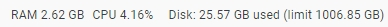
    
      My host machine CPU was AMD Ryzen 9 7900. My docker files are in `./assignment_sub/a3_docker` if you want a template. At the time it was Docker Engine 28.2.2, Docker Desktop 4.42.1.

    - Rent a cheap VPS with about 2 vCPU and 4 GB memory. One with 1 vCPU and 2 GB memory might work too but expect longer running time per task probably.

    - Use WSL. Theoretically should work too but I did not try it.

## Assignment previews

### By prev author

These are preview of results produced by the original repo owner's work on these assignments. Said owner seems to be a PhD who studied at [@gatech](https://github.com/gatech) so these are probably very good references.

#### A1_P4: RiverSwim MDP


#### A2_P2: Policy Gradient Methods


#### A3_P1-P3: Reward engineering, RLHF, DPO

| PPO (without early termination)  | PPO(with early termination) | RLHF |
| ----------- | ----------- | ----------- |
|  |  |  |

---

### By current author

In case anyone wants to compare answers with more people. Again no guarantee on correctness.

#### A1: RiverSwim

This is a screenshot of output after running the filled-out program.

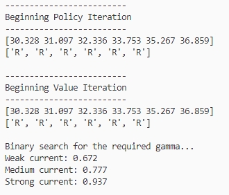

> Written part is at [a1_text.pdf](./assignment_sub/a1_text.pdf).

#### A2: REINFORCE and PPO

| Cartpole  | Pendulum | Cheetah |
| ----------- | ----------- | ----------- |
| 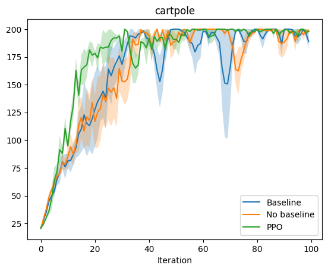 | 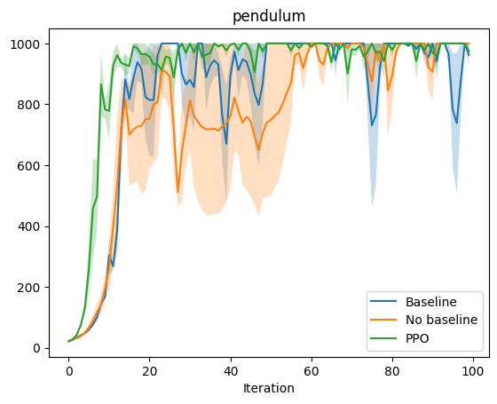 | 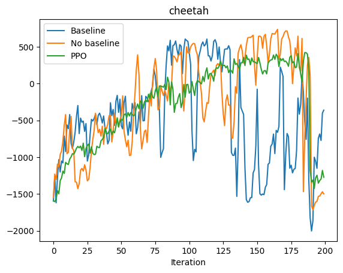 |

> Written part is at [a2_text.pdf](./assignment_sub/a2_text.pdf).

#### A3: RLHF, DPO

**Q2.2 e and g**

Plot of rewards from running RLHF for 3 different seeds, original vs RLHF only.

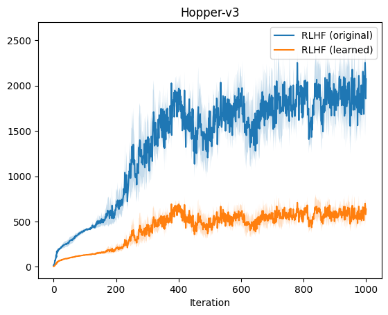

For brevity, only showing comparison of rollouts with one of the 3 seeds (seed 22).

| PPO (without early termination)  | PPO(with early termination) | RLHF |
| ----------- | ----------- | ----------- |
| 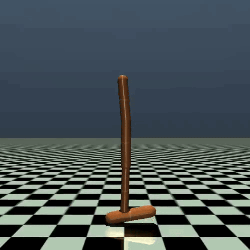 | 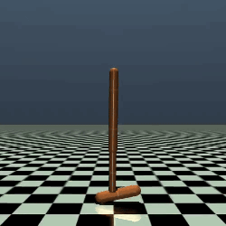 | 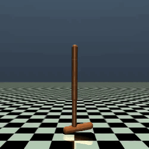 |

Worth noting that with RLHF, the leg in the rollout looks more "upright" and "humanly", and hops for longer distance before falling. 

**Q3.1 d and e**

Plot of rewards from running DPO for 3 different seeds.

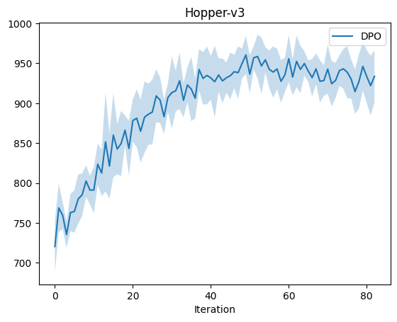

Videos (converted to gifs) of DPO vs SFT rollouts. For brevity, only showing those for seed 22, an instance where DPO improvement is "average" out of the three seeds: less than in seed 33, more than in seed 11.

| SFT  | DPO |
| ----------- | ----------- |
| 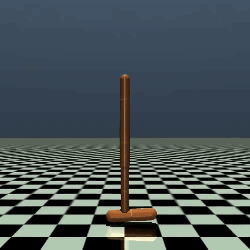 | 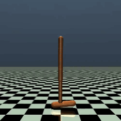 |

So overall the improvements are not visually exciting, but the rewards did get higher than in vanilla RLHF (see the organge curve in the Q2.2 e plot) in a much shorter time, which is maybe because it builds on top of SFT.

The lower-than-expected visual improvements may be because less efficient hyperparameters in my experiments, like the $\beta$, learning rate, etc. A detailed conjecture about it is in my submission for the written part. Or maybe just that my implementation was problematic 😶‍🌫️.

> Written part is at [a3_text.pdf](./assignment_sub/a3_text.pdf).

## Personal notes

Made mostly because I did not take the pre-requisite Machine Learning course at the first time of going through this course.

### Lecture notes

[./notes/NOTES_LECTURES.md](./notes/NOTES_LECTURES.md)

Includes:

- Some hand-written process for worked examples mentioned in lectures.
- Some notes on pre-requisite knowledge points, e.g. maximum likelihood estimation (MLE).

### Assignment Notes

[./notes/NOTES_ASGNMTS.md](./notes/NOTES_ASGNMTS.md)

Includes:
- Notes on some pre-requisite knowledge points, e.g. backpropagation, ReLU, etc.