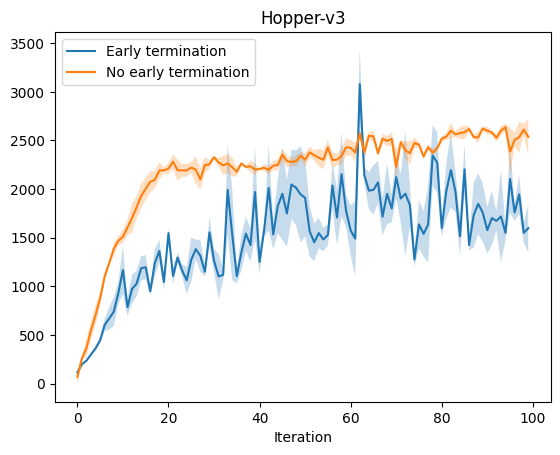

$$
\DeclareMathOperator*{\argmin}{arg\,min}
\DeclareMathOperator*{\argmax}{arg\,max}
$$

An introduction to reinforcement learning from human preferences

The goal of this assignment is to give you some hands-on experience with reinforcement learning from human preferences (RLHF). You will implement, compare, and contrast several different approaches for a robotics task in MuJoCo.

## Reward engineering (6 pts writeup + 7 pts coding)

In Assignment 2 you applied PPO to solve an environment with a provided reward function. The process of deriving a reward function for a specific task is called reward engineering.

### Written Questions (6 pts)

1. **(2 pts)** (**written**) Why is reward engineering usually hard? What are potential risks that come with specifying an incorrect reward function? Provide an example of a problem and a reward function that appears to be adequate but may have unintended consequences.
2. **(2 pts)** (**written**) Read the description of the [Hopper environment](https://gymnasium.farama.org/environments/mujoco/hopper/). Using your own words, describe the goal of the environment, and how each term of the reward functions contributes to encourage the agent to achieve it. (\textbf{Optional:} Do you agree with this reward function? Would you change it? How?)
3. **(2 pts)** (**written**) By default, the episode terminates when the agent leaves the set of ''healthy'' states. What do these ''healthy'' states mean? Name one advantage and one disadvantage of this early termination.

::: {.answer}
1. Reward engineering is difficult because, reward functions are approximations of our true goals, and translating complex goals into a precise numerical reward signal is non-trivial and error-prone.
<br>
Mistakes in specification can lead to unintended behaviors, of which a common one is "reward hacking," where the agent exploits loopholes in the reward to maximize it without achieving human engineers real goal.
<br>
For example, if a clearning robot's reward is based on the number of dirt spots cleaned, it might scatter dirt to gain more reward instead of cleaning effectively. We have also seen an example in A1 about a traffic optimization agent.

2. The goal is for the agent to control a 2D one-legged robot to "hop" (because it is only a leg) forward as far and as fast as possible without falling.
<br>
The reward function has three terms:
  <ul>
  <li>a forward velocity reward encouraging the agent to move forward (right).</li>
  <li>a healthy state bonus rewarding balance and preventing falls.</li>
  <li>a control cost penalizing large or abrupt actions to promote smooth and efficient movement.</li>
  </ul>
This combination encourages fast, stable hopping with realistic joint control.
<br>
I think I agree with this reward function, it accounts for most parts of the real goal, and it seems robust enough. I would maybe add another penalty that says the energy usage (battery etc.) cannot be too large, by using a `Σ|torque * angular_velocity|`. It may complicate learning or turns out to be not actually effective though.

3. "Healthy" states are those where the robot's joint angles, velocities, and torso position remain within bounds. These are possibly arbitrarily set ranges to mimic human bodily balances, and thus helping maintain upright and balanced localmotions.
<br><br>
One advantage I can think of is:
  <ul>
  <li>Such early termination encourages the agent to maintain stability and avoid catastrophic failure. It reduces waste of computation by resetting poor trajectories early.</li>
  </ul>
<br>
One disadvantage might be:
  <ul>
  <li>It can be overly conservative by cutting episodes short when recovery might still be possible, potentially limiting learning of recovery behaviors. Or it prevents a policy where an agent “fall” in a weird way that’s not actually catastrophic for the task of moving forward.</li>
  </ul>
:::

### Coding Questions (7 pts)

4.  (2 pts) (**coding**) Use the provided starter code to train a policy using PPO to solve the Hopper environment for 3 different seeds. Do this with and without early termination.

    ::: {.tcolorbox}
    ```bash
    python ppo_hopper.py [--early-termination] --seed SEED
    ```
    :::

5.  (2 pts) (**written**) Attach here the plot of the episodic returns along training, with and without early termination. You can generate the plot by running

    ::: {.tcolorbox}
    ```bash
    python plot.py --directory results --seeds SEEDS
    ```
    :::

    where `SEEDS` is a comma-separated list of the seeds you used. Comment on the performance in terms of training epochs and wall time. Is the standard error in the average returns high or low? How could you obtain a better estimate of the average return on Hopper achieved by a policy optimized with PPO?

6.  (2 pts) (**written**) Pick one of the trained policies and render a video of an evaluation rollout.

    ::: {.tcolorbox}
    ```bash
    python render.py --checkpoint [PATH TO MODEL CHECKPOINT]
    ```
    :::

    Does the agent successfully complete the assigned task? Does it complete it in the way you would expect it to, or are you surprised by the agent behavior?

7.  (1 pts) (**written**) Render another video for another policy. How do the two rollouts compare? Do you prefer one over the other?

::: {.answer}
4. Completed. Used seed numbers $11, 22, 33$. Commands were:
  <br>
  <div class="note">
    ```python ppo_hopper.py --seed 11```

    ```python ppo_hopper.py --early-termination --seed 11```

    ```python ppo_hopper.py --seed 22```

    ```python ppo_hopper.py --early-termination --seed 22```

    ```python ppo_hopper.py --seed 33```

    ```python ppo_hopper.py --early-termination --seed 33```
  </div>.<br>

5. Below is a plot of episodic returns along training, with and without early termination.
<br>
{#fig-plot-epi-returns width=60%}
<br>
Generated by running
  <br>
  <div class="note">
  ```python plot.py --directory results -o output --seeds 11,22,33```.
  </div><br>
Observations in training epochs:
  <ul>
  <li>The agent learns (gain returns) faster at early stages when there is no early termination. The curve plateaus sooner.</li>
  <li>The agent is more conservative (gain less returns after learning plateaus) when there is early termination.</li>
  <li>Returns fluctuate more at later stages in the with-early-termination case.</li>
  </ul>
The wall time of trainings with no early termination was about 770s on my machine, and that of trainings with early termination was about 650s. So the agent seems to learn less from the environment when there is early termination.
The standard error in average returns is relatively high, due to using only 3 random seeds. To improve return estimates, I think we could train using at least 5–10 seeds and evaluate each checkpoint with multiple rollout episodes to better capture performance variance across runs.

6. This is rendered video of the trained policy with seed `11`, no early termination.
  <br>
  <video controls width="320">
  <source src="../a3_code/results/Hopper-v3-early-termination=False-seed=11/video.mp4" type="video/mp4">
  Your browser does not support the video tag.
  </video>
  <br>
This is rendered video of the trained policy with seed `11`, with early termination.
  <br>
  <video controls width="320">
  <source src="../a3_code/results/Hopper-v3-early-termination=True-seed=11/video.mp4" type="video/mp4">
  Your browser does not support the video tag.
  </video>
  <br>
Generated by running
  <br>
  <div class="note">
  ```python render.py --checkpoint results/Hopper-v3-early-termination=False-seed=11/model.zip```
  ```python render.py --checkpoint results/Hopper-v3-early-termination=True-seed=11/model.zip```.
  </div><br>
In both of these, I would say the agent successfully completes the assigned task, because they have indeed hopped forward, although the with-early-termination agent was cut short because of the unhealthy posture.
<br>
The agent in the no early termination case is not completing the task in the way I expected, because its local motions are unnatrual from a human's perspective. I was surprised that it continues to move forward using that kind of postures, which looks anti-physics when I expected to see human-like gaits.
<br>
But I suppose it makes sense in the simplified Hopper environment. The Mujoco physics engine has quirks that agents can exploit (e.g., no fatigue, friction artifacts). Also, since there's no penalty for looking weird (unless it breaks healthy state rules), the agent is free to learn whatever works.
<br>
Another surprise is that it tends to "stand back up" at some point, which does not appear in the other two trained policies with no early termination.
<br>

7. This is rendered video of the trained policy with seed `22`, no early termination.
  <br>
  <video controls width="320">
  <source src="../a3_code/results/Hopper-v3-early-termination=False-seed=22/video.mp4" type="video/mp4">
  Your browser does not support the video tag.
  </video>
  <br>
This is rendered video of the trained policy with seed `22`, with early termination.
  <br>
  <video controls width="320">
  <source src="../a3_code/results/Hopper-v3-early-termination=True-seed=22/video.mp4" type="video/mp4">
  Your browser does not support the video tag.
  </video>
  <br>
Compared with the rollouts of policy with seed 11, the rollouts of policy with seed 22 are not very different. I like rollouts of policy with seed 22 a bit more, because from the video of rollout with early termination, the motions it produces looks a bit more stable near the end of the training: slightly less global vertical bouncing, and traveled a bit further with seemingly smoother control.
:::

## Learning from preferences (5 pts writeup + 25 pts coding)

In the previous part you trained multiple policies from scratch and compared them at the end of training. In this section, we will see how we can use human preferences on two roll-outs to learn a reward function.

We will follow the framework proposed by [@christiano_deep_2017]. A reward function $r: \mathcal{O} \times \mathcal{A} \rightarrow \mathbb{R}$ defines a preference relation $\succ$ if for all trajectories $\sigma^i = (o^i_t,a^i_t)_{t=0,...,T}$ we have that

$$
\left(\left(o_0^1, a_0^1\right), \ldots,\left(o_{T}^1, a_{T}^1\right)\right) \succ\left(\left(o_0^2, a_0^2\right), \ldots,\left(o_{T}^2, a_{T}^2\right)\right)
$$

whenever

$$
r\left(o_0^1, a_0^1\right)+\cdots+r\left(o_{T}^1, a_{T}^1\right)>r\left(o_0^2, a_0^2\right)+\cdots+r\left(o_{T}^2, a_{T}^2\right) .
$$

Following the Bradley-Terry preference model [@bradley_rank_1952], we can calculate the probability of one trajectory $\sigma^1$ being preferred over $\sigma^2$ as follows:

$$
\hat{P}\left[\sigma^1 \succ \sigma^2\right]=\frac{\exp \sum \hat{r}\left(o_t^1, a_t^1\right)}{\exp \sum \hat{r}\left(o_t^1, a_t^1\right)+\exp \sum \hat{r}\left(o_t^2, a_t^2\right)},
$$

where $\hat{r}$ is an estimate of the reward for a state-action pair. This is similar to a classification problem, and we can fit a function approximator to $\hat{r}$ by minimizing the cross-entropy loss between the values predicted with the above formula and ground truth human preference labels $\mu(1)$ and $\mu(2)$:

$$
\operatorname{loss}(\hat{r})=-\sum_{\left(\sigma^1, \sigma^2, \mu\right) \in \mathcal{D}} \mu(1) \log \hat{P}\left[\sigma^1 \succ \sigma^2\right]+\mu(2) \log \hat{P}\left[\sigma^2 \succ \sigma^1\right] .
$$

Once we have learned the reward function<span class="footnote-star">*</span>, we can apply any policy optimization algorithm (such as PPO) to maximize the returns of a model under it.

::: {.callout-note}
**\*** Recent work on RLHF for reinforcement learning suggests that the pairwise feedback provided by humans on partial trajectories may be more consistent with regret, and that the learned reward function may be better viewed as an advantage function. See Knox et al. AAAI 2024 *"Learning optimal advantage from preferences and mistaking it for reward."* [https://openreview.net/forum?id=euZXhbTmQ7](https://openreview.net/forum?id=euZXhbTmQ7)
:::

### Written questions (5 pts)

1. (5 pt) Let $\hat{r}(o,\ a) = \phi_w(o,\ a)$. Calculate $\nabla_w \operatorname{loss}(\hat{r}(o,\ a))$.

::: {.answer}
1. For convenience, denote:
$$R_1 = \sum_t \phi_w(o_t^1, a_t^1), \quad R_2 = \sum_t \phi_w(o_t^2, a_t^2).$$
So:
$$
\hat{P}[\sigma^1 > \sigma^2] = \frac{e^{R_1}}{e^{R_1} + e^{R_2}}, \quad \hat{P}[\sigma^2 > \sigma^1] = \frac{e^{R_2}}{e^{R_1} + e^{R_2}}.
$$
The gradient of a sum is the sum of gradients. So we can look at the loss for a single pair $(\sigma^1, \sigma^2, \mu)$:
$$
\ell(w) = -\mu(1) \log \left( \frac{e^{R_1}}{e^{R_1} + e^{R_2}} \right) - \mu(2) \log \left( \frac{e^{R_2}}{e^{R_1} + e^{R_2}} \right).
$$
Apply log rules:
$$
\ell(w) = -\mu(1)(R_1 - \log(e^{R_1} + e^{R_2})) - \mu(2)(R_2 - \log(e^{R_1} + e^{R_2})).
$$
Group terms:
$$
\ell(w) = -\mu(1) R_1 - \mu(2) R_2 + (\mu(1) + \mu(2)) \log(e^{R_1} + e^{R_2}).
$$
Now differentiate w.r.t. $w$:
$$
\nabla_w \ell(w) = -\mu(1) \nabla_w R_1 - \mu(2) \nabla_w R_2 + (\mu(1) + \mu(2)) \nabla_w \log(e^{R_1} + e^{R_2}). \tag{1}
$$
Recall:
$$
\nabla_w \log(e^{R_1} + e^{R_2}) = \frac{e^{R_1} \nabla_w R_1 + e^{R_2} \nabla_w R_2}{e^{R_1} + e^{R_2}} = \hat{P}[\sigma^1 > \sigma^2] \nabla_w R_1 + \hat{P}[\sigma^2 > \sigma^1] \nabla_w R_2
$$
, and plug it into $(1)$:
$$
\nabla_w \ell(w) = -\mu(1) \nabla_w R_1 - \mu(2) \nabla_w R_2 + (\mu(1) + \mu(2)) \left( \hat{P}[\sigma^1 > \sigma^2] \nabla_w R_1 + \hat{P}[\sigma^2 > \sigma^1] \nabla_w R_2 \right).
$$
Factor terms:
$$
\nabla_w \ell(w) = \left(-\mu(1) + (\mu(1) + \mu(2))\hat{P}[\sigma^1 > \sigma^2]\right) \nabla_w R_1 + \left(-\mu(2) + (\mu(1) + \mu(2))\hat{P}[\sigma^2 > \sigma^1]\right) \nabla_w R_2.
$$
By using the fact that
$$\mu(1) + \mu(2) = 1$$
, it can be further simplified as:
$$
\nabla_w \text{loss}(\hat{r}) = \sum_{(\sigma^1, \sigma^2, \mu) \in D} \left( (\hat{P}[\sigma^1 > \sigma^2] - \mu(1)) \nabla_w R_1 + (\hat{P}[\sigma^2 > \sigma^1] - \mu(2)) \nabla_w R_2 \right).
$$
:::

### Coding questions (25 pts)

In this problem we are trying to solve the same task as in the previous part, but this time we will learn a reward function from a dataset of preferences rather than manually specifying a reward function.

2. (5 pt) Load one of the samples from the preference dataset we provide you, and render a video of the two trajectories using the following command

    ```bash
    python render.py --dataset [PATH TO PREFERENCE DATASET FILE] --idx IDX
    ```

    where `IDX` is an index into the preference dataset (if ommitted a sequence will be chosen at random). Bear in mind that each sequence in the dataset has 25 timesteps, which means that the resulting videos will have 0.2 seconds. Take note of which sequence was labeled as preferred (this information will appear in the name of the generated videos, but for the coming parts it is helpful to know that $0$ means the first sequence was preferred, $1$ means the second one, and $0.5$ means neither is preferred over the other). Do you agree with the label (that is, if shown the two trajectories, would you have ranked them the same way they appear in the dataset, knowing that we are trying to solve the Hopper environment)?

3. (3 pt) Repeat the previous question for 4 more samples, keeping track of whether you personally agree with the dataset preference label. Use this to estimate how much you agree with whoever ranked the trajectories. How much did you get? Based on this agreement estimate, would you trust a reward function learned on this data?

4. (8 pt) Implement the functions in the `RewardModel` class (`run_rlhf.py`), which is responsible for learning a reward function from preference data.

5. (5 pt) Train a model using PPO and the learned reward function with 3 different random seeds. Plot the average returns for both the original reward function and the learned reward function and include it in your response.

    ```bash
    python plot.py --rlhf-directory results_rlhf --output \
          results_rlhf/hopper_rlhf.png
    ```

    Do the two correlate?

6. (1 pt) Is the learned reward function identifiable?

7. (3 pt) Pick one of the policies and render a video of the agent behavior at the end of training.

    ```bash
    python render.py --checkpoint [PATH TO MODEL CHECKPOINT]
    ```

    How does it compare to the behavior of the agent generated by policies trained from scratch? How does it compare to the demonstrations you've seen from the dataset?

::: {.answer}
2. After inspecting that the index range is $0$ to $9999$, I used this command
    
    ```bash
    python render.py --dataset data/prefs-hopper.npz --idx 456
    ```
    to render the sample with index `456`. For this sample, the result is equally preferred. I watched the videos, and indeed could not tell the difference between the two rollouts. So I would say I agree with the labeling.
3. I rendered 4 more samples using the same command without specifying indices. The randomly chosen indices were `394`, `6866`, `7560` and `6851`. Here is a table recording the difference between my labeling and the person who labeled these samples.

    | index  | embeded preference  |  my preference  | do we agree? |
    |--------|---------------------|-----------------|-----------------|
    | 456    | 0.5 equally preferred | equally preferred | yes |
    | 394    | 0.5 equally preferred | equally preferred | yes |
    | 6866   | 0.0 1st preferred     | equally preferred | no  |
    | 7560   | 0.0 1st preferred     | 1st preferred     | yes |
    | 6851   | 0.0 1st preferred     | 1st preferred     | yes |

    Based on this agreement estimate, I think I could reasonably trust a reward function learned on this data.
4. All of `__init__()`, `forward()`, `compute_reward()`, and `update()` have been implemented.
5. I used these commands to run the $RLHF$ procedure

    ```bash
    python run_rlhf.py --seed [SEED]
    ```

    for three different seeds `11`, `22` and `33`, to be consistent with previous work. Other command line arguments like

    ```bash
    --env-name
    --dataset-path
    --reward-min
    --reward-max
    --reward-model-hidden-dim
    --reward-model-steps
    --reward-model-batch-size
    --rl-steps
    --eval-period
    --num-eval-episodes
    ```

    are not inputted because the defaults are good engough.
    
    Using command
    
    ```bash
    python plot.py --rlhf-directory results_rlhf --output results_rlhf/hopper_rlhf.png --seeds 11,22,33
    ```

    , below is the plotted aggregated graph of the 6 curves put together.
    {#fig-rlhf-vs-original width=60%}

    **Correlation**

    I observe pretty strong correlation. Across all three seeds, the average learned return and average original return:
    - Increase at the same training steps.
    - Plateau around the same time.
    - Fluctuate in sync during the plateau phase.

    It may worth noting that the learned return appears like a “vertically compressed” version of the original return. This is likely the effect of the $RLHF$ rewards being scaled.

    This indicates that:
    - The reward model captures the relative quality of behaviors well, since trends in learned return correlate with trends in true return.
    - The reward model does not quite match the scale or exact values of the environment’s reward function, which is expected, since it was trained only on pairwise preferences, with a scaled-down (remapped into range [self.r_min, self.r_max]) proxy of the real reward. But the trend preservation tells us it is a good proxy.
6. No, the learned reward function is not identifiable because multiple reward functions, e.g. differing by positive scaling or translation, can explain the same human preferences.
7. I actually rendered videos for all three seeds using commands:

    ```bash
    python render.py --checkpoint results_rlhf/Hopper-v3-rlhf-seed=[SEED]/model.zip
    ```

    and visually compared them with videos for policies trained from scratch using the true Hopper reward (done for problem 1.2), who used the same set of seeds.

    Here is the video for seed `22` as an example.
    <br>
    <video controls width="320">
    <source src="../a3_code/results_rlhf/Hopper-v3-rlhf-seed=22/video.mp4" type="video/mp4">
    Your browser does not support the video tag.
    </video>
    <br>
    
    **Comparison**
    - Compared to PPO agents trained from scratch, the RLHF-trained agents exhibited more natural and stable behavior. Their legs remained upright (rather than dragging or crawling), and the agent covered greater distances with smoother hops.
    - These traits were more aligned with the human demonstrations seen in the dataset, suggesting that the learned reward better captures human-preferred locomotion than the environment's native reward function does.
:::

## Direct preference optimization (25 pts coding)

In the previous question we saw how we could train a model based on preference data. However, suppose you are given a pre-trained model and the corresponding preference data. Ideally, you would like to optimize the model directly on the preference data, instead of having to learn a reward function, and then run PPO on it. That is the idea behind direct preference optimization (DPO) [@rafailov_direct_2023]. The algorithm proposed in the original paper allows us to skip the reward learning and reinforcement learning steps, and optimize the model directly from preference data by optimizing the following loss:

$$\mathcal{L}_{\mathrm{DPO}}\left(\pi_\theta ; \pi_{\mathrm{ref}}\right)=-\mathbb{E}_{\left(x, y_w, y_l\right) \sim \mathcal{D}}\left[\log \sigma\left(\beta \log \frac{\pi_\theta\left(y_w \mid x\right)}{\pi_{\mathrm{ref}}\left(y_w \mid x\right)}-\beta \log \frac{\pi_\theta\left(y_l \mid x\right)}{\pi_{\mathrm{ref}}\left(y_l \mid x\right)}\right)\right],$$

where $\pi_{\mathrm{ref}}$ is the policy from which we sampled $y_w$ and $y_l$ given $x$, $\pi_\theta$ is the policy we are optimizing, and $\sigma$ is the sigmoid function.

We will use DPO in this question as well. To provide some context, let us consider the general approach for RLHF for text generation:

<div class="numeric">
1.  Train a large language model (LLM) to do next token prediction given a context (the tokens that came previously).
2.  Given a fixed context $x$, generate possible next token sequence predictions $y_1$ and $y_2$, and store the triple $(x, y_1, y_2)$.
3.  Ask human supervisors to rank $y_1$ and $y_2$ given $x$ according to individual preference.
4.  Update the LLM to maximize the probability of giving the preferred answers using reinforcement learning.
</div>

In a similar way, given an observation $x$ we could have two ranked sequences of actions $a^1_{1:T}$ and $a^2_{1:T}$, train the model to generate the preferred sequence of actions, and then execute them all<span class="footnote-star">*</span>. If the length of the generated action sequence is equal to the environment time horizon, this is called open-loop control. However, this approach lacks robustness, since the plan of actions will not change in response to disturbances or compounding errors. Instead, we are going to adapt this into a more robust scheme by training our policy to predict a sequence of actions for the next $T$ time steps (where $T$ is the length of the trajectories in our preference dataset), but only take the first action in the plan generated by the policy. In this way, we re-plan our actions at every time step, ensuring the ability to respond to disturbances.

::: {.callout-note}
**\*** To understand why we are considering sequences of actions rather than a single action for the next time, recall that $25$ actions corresponded to $0.2$ seconds of video. If you found it difficult to rank a sequence of $25$ actions based on such a short video, imagine ranking the effect of a single action!
:::

### Coding questions (25 pts)

1.  (9 pts) Implement the `ActionSequenceModel` class instance methods. When called, the model should return a probability distribution for the actions over the number of next time steps specified at initialization. Use a multivariate normal distribution for each action, with mean and standard deviation predicted by a neural network (see the starter code for more details)<span class="footnote-star">*</span>.

    ::: {.callout-note}
    **\*** We have prepared a [notebook](https://colab.research.google.com/drive/1sw8FJIR5865laTJiI0fqHG3KcGVT23ED) to illustrate the behavior of [`torch.distributions.Independent`](https://pytorch.org/docs/stable/distributions.html#independent).
    :::

2.  (3 pts) Implement the `update` method of the `SFT` class. This class will be used to pre-train a policy on the preference data by maximizing the log probabilities of the preferred actions given the observations in the dataset.

3.  (5 pts) Implement the `update` method of the `DPO` class. This should minimize the DPO loss described above.

4.  (5 pts) Run DPO for 3 different random seeds (you may want to tweak the number of DPO steps to get better results), and plot the evolution of returns over time.

    ::: {.tcolorbox}
    ```bash
    python plot.py --dpo-directory results_dpo --output \
        results_dpo/hopper_dpo.png
    ```
    :::

    Include that plot in your response. How does it compare to the returns achieved using RLHF? Comment on the pros and cons of each method applied to this specific example.

5.  (3 pts) Render a video of an episode generated by the pre-trained policy, and a video of an episode generated by the policy tuned by DPO.

    ::: {.tcolorbox}
    ```bash
    python render.py --dpo --checkpoint [PATH TO MODEL CHECKPOINT]
    ```
    :::

    How do they compare?

::: {.answer}
1. All of `__init__()`, `forward()`, `distribution()`, and `act()` have been implemented.
2. Implemented.
3. Implemented.
4. Initially used these parameters:

    ```bash
    python run_dpo.py --seed 11 --num-dpo-steps 50000 --dpo-lr 3e-7 --eval-period 1000
    python run_dpo.py --seed 22 --num-dpo-steps 50000 --dpo-lr 3e-7 --eval-period 1000
    python run_dpo.py --seed 33 --num-dpo-steps 50000 --dpo-lr 3e-7 --eval-period 1000
    ```

    , but the results of trainings with seeds 22 and 33 showed decreasing return after some time steps. So I did many tweaks such as:

    - Different --num-dpo-steps values to find the roughly "optimal" number just before the returns started to decline.
    - Different --dpo-lr values for the chosen seeds, and find a best one for each seed.
    
    Here are the parameters that were settled on:

    ```bash
    python run_dpo.py --seed 11 --num-dpo-steps 83000 --dpo-lr 3e-7 --eval-period 1000
    python run_dpo.py --seed 22 --num-dpo-steps 83000 --dpo-lr 2e-7 --eval-period 1000
    python run_dpo.py --seed 33 --num-dpo-steps 83000 --dpo-lr 3e-7 --eval-period 1000
    ```

    . The idea was to fix a good num-dpo-steps as much as possible, and then find a good dpo-lr that brings the best out of each subset of data under this num-dpo-steps value.
    
    Using the provided script

    ```bash
    python plot.py --dpo-directory results_dpo --output results_dpo/hopper_dpo.png --seeds 11,22,33
    ```

    , the following aggregated plot was made.
    {#fig-dpo-returns width=60%}
    
    **Observations**
    - Speed: DPO gets up to good behavior far faster than RLHF.
    - Final performance: DPO achieves higher mean returns on Hopper under the same horizon and evaluation protocol.
    - Hyperparameter sensitivity: DPO required manual tuning (learning rate and number of training steps) to avoid collapse after the plateau.
    
    **Pros-cons comparison**

    DPO pros

    - Learns end-to-end directly from preference data; skips the two-stage reward model + PPO loop.
    - Rapid improvement in early training.
    - Higher final returns on this Hopper task (≈950 vs. 600), but may be due to reward-scale differences.

    DPO cons

    - Sensitive to hyperparameters (learning rate, number of steps).
    - No explicit reward model means less interpretability of learned “reward.”
    - May overfit preferences if not carefully regularized.

    RLHF pros

    - Modular: explicit reward model that you can inspect, visualize, or reuse.
    - PPO adds robustness via environment interaction and on-policy exploration.
    - More stable across seeds with default settings.

    RLHF cons

    - Slower: two phases (reward fitting + PPO) each require many steps.
    - Lower returns in this Hopper problem (again may partly incorporating differences in reward scaling).
5. Considering that both policies in each pair are stochastic, I rendered several for each. For example, under the folder with seed 11, 3 videos with model_sft.pt and 3 videos with model.pt were rendered and compared. Then the human mind tried to qualitatively catch differences in the trends.

    DPO's improving effect may not be obvious at all in some of these. I observed that some datasets tend to result in SFT policies that produces worse rollouts, and some tend to result in better ones, so I suppose varied effects of DPO is not abnormal. Also the numerical rewards improvement was only about 350, which is indeed not that much.
    
    But in general, there is a trend of DPO fine-tuned policy rollouts exhibiting slightly more balanced gaits and slighty longer hopping distances.
:::