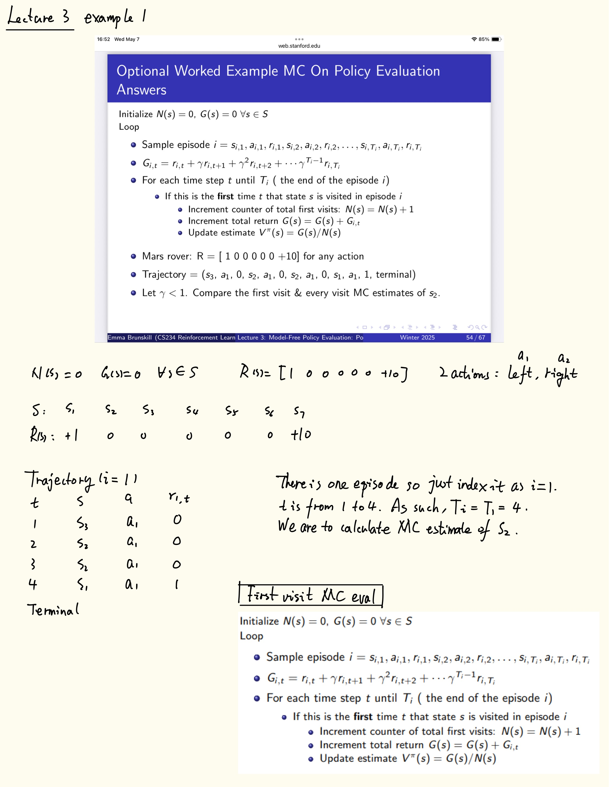
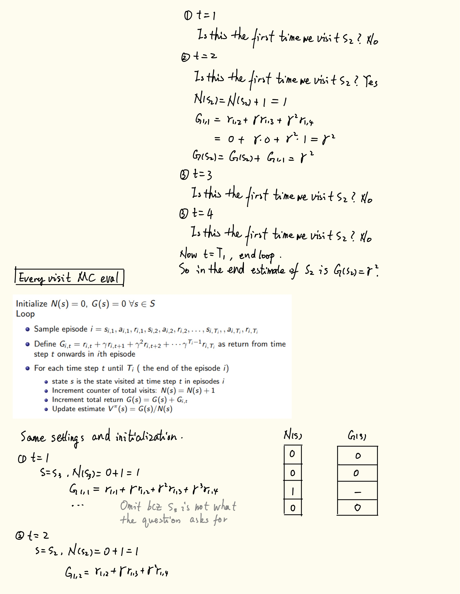
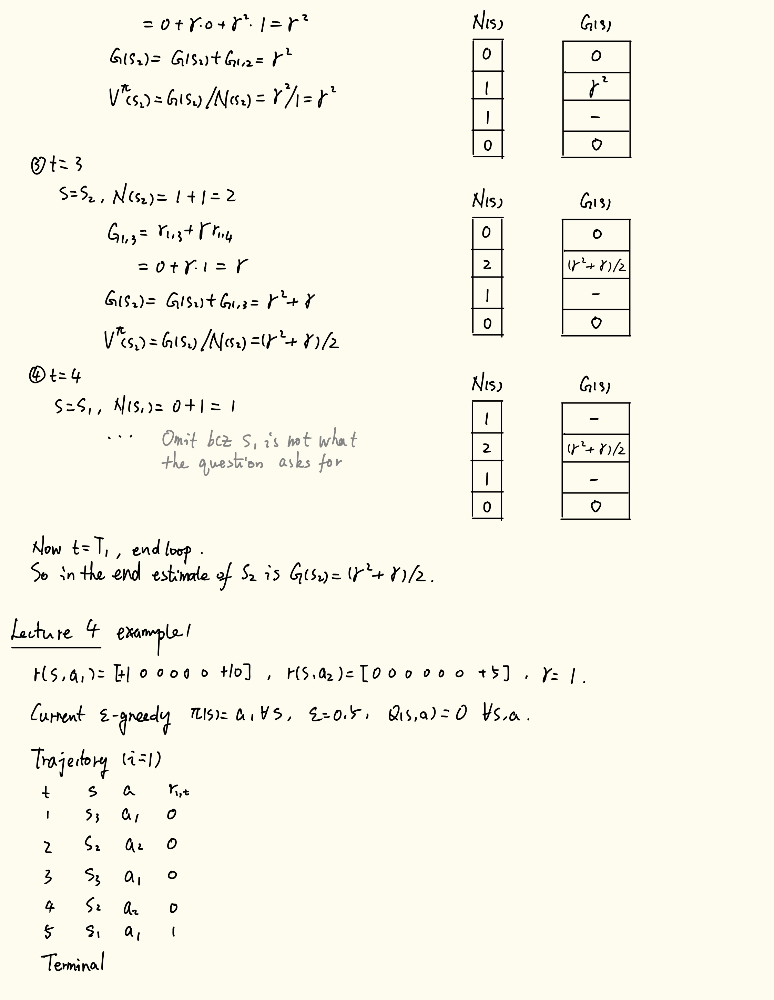
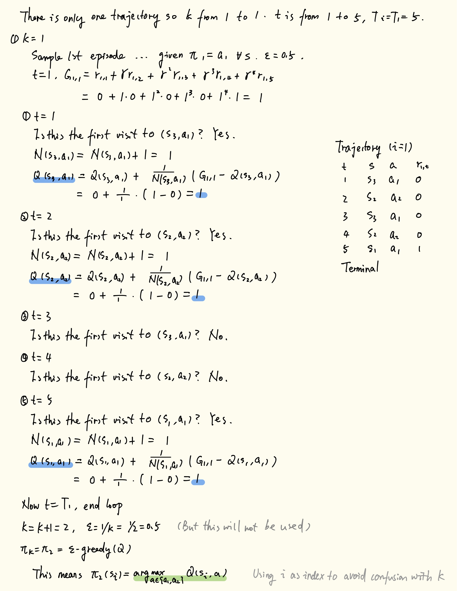
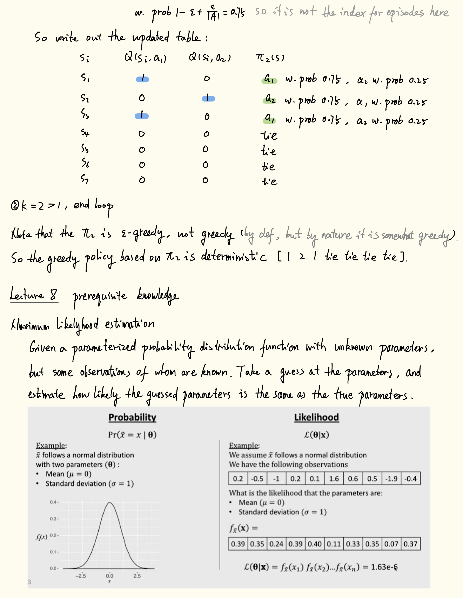
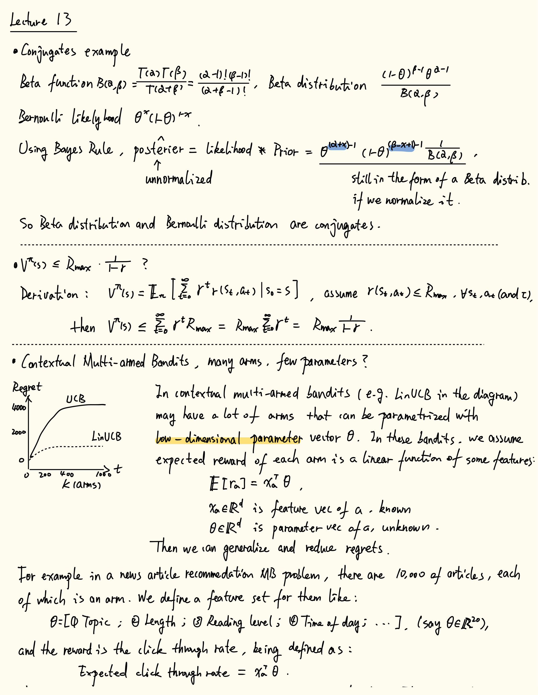
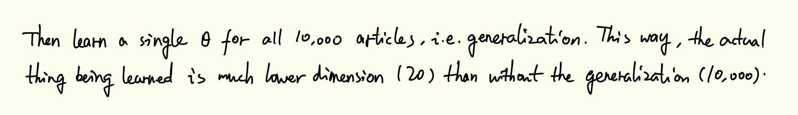

<!-- TOC -->

- [Lecture 3](#lecture-3)
    - [Example 1 MC policy evaluation](#example-1-mc-policy-evaluation)
- [Lecture 4](#lecture-4)
    - [Example 1 $\epsilon$ -greedy policy improvement](#example-1-\epsilon--greedy-policy-improvement)
- [Lecture 8 minor prereq knowledge](#lecture-8-minor-prereq-knowledge)
    - [Maximum likelihood](#maximum-likelihood)
    - [Max entropy principle in information theory](#max-entropy-principle-in-information-theory)
- [Lecture 13](#lecture-13)
    - [On conjugate distribs, bound error Vmax and Contextual Multi-armed Bandits](#on-conjugate-distribs-bound-error-vmax-and-contextual-multi-armed-bandits)
    - [Simulation lemma bound error derivation, Δ and the sums](#simulation-lemma-bound-error-derivation-δ-and-the-sums)

<!-- /TOC -->

# Lecture 3

## Example 1 MC policy evaluation

# Lecture 4

## Example 1 $\epsilon$ -greedy policy improvement

The start is on the previous page.

# Lecture 8 minor prereq knowledge

## Maximum likelihood

The start is on the previous page.  
The youtube link mentioned here is https://www.youtube.com/watch?v=myeAGFTKYkY .

## Max entropy principle in information theory

The expert data (assumed to be optimal) may correspond to many optimal reward functions. We want the reward functions to induce probability distributions of trajectories that match the expert demonstrations.

But why do we want to choose the max entropy one? This comes from the Maximum Entropy Principle in information theory, which uses the Shannon Entropy to represent uncertainty.

$$E = H ( p_1, p_2, ..., p_n) = - \sum_i p_i log p_i.$$

This arised from 3 properties of such a representation function $H$:
1. $H$ should be continuous in the $p_i$.
2. If all the $p_i$ are equal, $pi = frac{1}{n}$, then $H$ should be a monotonic increasing function of n.
3. If a choice be broken down into two successive choices, the original $H$ should be the weighted sum of the individual values of $H$.

See the [original paper](https://people.math.harvard.edu/~ctm/home/text/others/shannon/entropy/entropy.pdf) for details. Also there is a nice simple example with a 3 value variable in [arxiv.org/pdf/1405.2061](https://arxiv.org/pdf/1405.2061), and a simple dice example in [...ece587/Lecture11.pdf](https://www2.isye.gatech.edu/~yxie77/ece587/Lecture11.pdf).

Following this, there is:

The <b>Principle of Maximum Entropy</b> is based on the premise that when estimating the probability distribution, you should select that distribution which leaves you the largest remaining uncertainty (i.e., the maximum entropy) consistent with your constraints (<a href="https://mtlsites.mit.edu/Courses/6.050/2003/notes/chapter10.pdf" target="_blank">Chapter 10 of some course in MIT</a>).

In RL, we can use this principle and choose a max entropy reward function, so that it induces a trajectory distribution that:

- Explains the observed expert behavior.
- While being as uncertain as possible about the parts of the environment the expert didn’t visit.

# Lecture 13

## On conjugate distribs, bound error Vmax and Contextual Multi-armed Bandits

- Conjugate distributions example
- Simulation lemma, bound error derivation, why is $V^{\pi}(s) \le R_{max} \cdot \frac{1}{1-\gamma}$
- Contextual Multi-armed Bandits, low-dim parameters

## Simulation lemma bound error derivation, Δ and the sums

The derivation is:

> Assume for $\pi$ fixed, we already have bounds on reward and dynamics models
> $$|R_1(s,a) - R_2(s,a)|_{\infty} \leq \alpha, \quad |T_1(s'|s,a) - T_2(s'|s,a)| \leq \beta$$
> 
> Then difference in Q function
> $$|Q_1^{\pi}(s,a) - Q_2^{\pi}(s,a)| = |R_1(s,a) + \gamma \sum_{s'} T_1(s'|s,a) V_1^> {\pi}(s') - (R_2(s,a) + \gamma \sum_{s'} T_2(s'|s,a) V_2^{\pi}(s'))|$$
>
> $$\leq |R_1(s,a) - R_2(s,a)| + \gamma|\sum_{s'} [T_1(s'|s,a) V_1^{\pi}(s') - T_2(s'|> s,a) V_2^{\pi}(s')]|$$
>
> (*From here we use shorthand $T_1(s') := T_1(s'|s,a), T_2(s') := T_2(s'|s,a)$.*)
>
> $$... \leq \alpha + \gamma|\sum_{s'} [T_1(s') V_1^{\pi}(s') - T_1(s') V_2^{\pi}(s') > + T_1(s') V_2^{\pi}(s') - T_2(s') V_2^{\pi}(s')]|$$
>
> $$\leq \alpha + \gamma|\sum_{s'} T_1(s') (V_1^{\pi}(s') - V_2^{\pi}(s')) + \sum_> {s'} (T_1(s') - T_2(s')) V_2^{\pi}(s')|$$
>
> Define maximum difference and bound
> $$\max_{s'} |V_1^{\pi}(s') - V_2^{\pi}(s')| \equiv \Delta, \quad \beta \leq V_{\max}$$
> 
> So
> $$... \leq \alpha + \gamma \Delta \sum_{s'} T_1(s') + \gamma V_{\max} \beta$$
> 
> Note that $|Q_1^{\pi}(s,a) - Q_2^{\pi}(s,a)| \text{ also } \leq \Delta$.
> 
> So finally
> $$... \Rightarrow \Delta \leq \alpha + \gamma \Delta + \gamma V_{\max} \beta$$
> $$\Rightarrow (1-\gamma) \Delta \leq \alpha + \gamma V_{\max} \beta$$
> $$\Rightarrow \Delta \leq \frac{1}{1-\gamma}(\alpha + \gamma V_{\max} \beta)$$

- Why can we remove the $\sum_{s'}$?

    The first one is because the transition dynamic $T_1(s'|s,a)$ is a probability distribution, so $\sum_{s'} T_1(s') \cdot \Delta = \Delta$.

    The second one is more of a notation issue. It seems the lecturer meant to say $\sum_{s'} |T_1(s') - T_2(s')| \le \beta$ as an assumption, in a total variation norm sense.

- Recursiveness of $\Delta$?

    Just before the final step we derived that    
    $$|Q_1^{\pi}(s,a) - Q_2^{\pi}(s,a)| \leq \alpha + \gamma\Delta + \gamma V_{\max}\beta.$$

    Recall that there is a relation between $V$ and $Q$ for **one fixed** $\mathbf{\pi}$ (assume deterministic, $\pi(s) = a$ for simplicity):
    $$V^{\pi}(s) = R(s,\pi(s)) + \gamma \sum_{s'} T(s'|s,\pi(s))V^{\pi}(s')$$
    $$Q^{\pi}(s,a) = R(s,a) + \gamma \sum_{s'} T(s'|s,a)V^{\pi}(s')$$
    $$\Rightarrow Q^{\pi}(s,\pi(s)) = V^{\pi}(s).$$
    
    So there is:
    $$|Q_1^{\pi}(s,a) - Q_2^{\pi}(s,a)| \le \Delta$$
    , which we can substitute into the LHS of the inequality.

    Note: For a stochastic $\pi$ it would be like $|Q_1^{\pi}(s,a) - Q_2^{\pi}(s,a)| \leq \gamma \Delta$.
